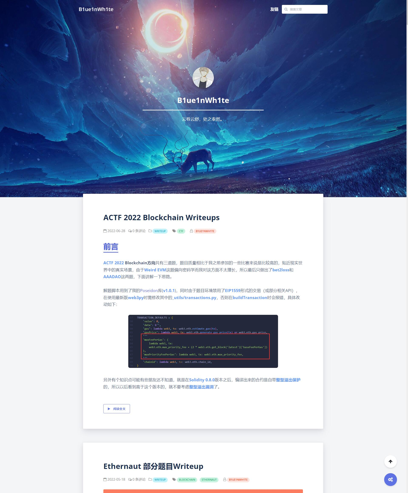

# 示例

<div align="center">

[博客链接](https://www.seaeye.cn/)

</div>



# 使用

## 安装

在 [Releases](https://github.com/B1ue1nWh1te/BlueBubble/releases) 下载 zip 文件，将所有文件解压到 Typecho 主题目录（./usr/themes/BlueBubble）。

## 设置

设置页位置：`Typecho 后台 -> 控制台 -> 外观 -> 设置外观`

> 站点副标题

该项用以设定首页的标题栏中站点标题后显示的文字。

> 站点 LOGO

该项应为一个图片的 URL 地址，将显示在顶部标签标题左边。（请勿使用相对地址）

> 站点头像

该项应为一个图片的 URL 地址，将显示在首页大标题上方。（请勿使用相对地址）

> 名言

该项应为一个句子，将添加在站点头像下方。

> 首页背景图像

该项应为一个图片的 URL 地址，用以设定网站首页背景图片，留空则使用默认紫色渐变背景。（请勿使用相对地址）

> 随机背景图像地址

该项应为一个或多个图片的 URL 地址，用以设定网站文章页、独立页面以及其他页面的头图，设定后将从给定的图片中随机抽取一个显示，留空则使用默认紫色渐变背景。

URL 之间用换行隔开，即每行一个 URL，**请勿包含多余字符**。（请勿使用相对地址）

> 背景气泡

该项用以选择是否在首页以及文章页顶部背景处显示半透明气泡。

> 页脚内容

该项用以设定页脚内容，可添加 HTML 代码以实现更丰富的功能。

> 自定义 CSS

该项用以提供自定义 css 接口，用户可以填入自己需要的 css 代码来改变主题外观，例如更改字体大小。自定义 css 的生效不需要清空缓存。

> 百度统计 API KEY

该项用以支持网站使用百度统计进行流量统计分析。

> 全站 pjax 模式

该项用以选择是否启用全站 pjax 模式提升用户访问体验。

请注意：开启该功能后可能会导致站点一些功能不正常，例如如果您未使用主题自带数学公式渲染，而是选择使用其他插件实现该功能，则会导致无刷新打开页面时数学公式插件不工作，因此请仔细检查后决定是否开启该模式。

如果您发现部分功能确实出现了问题，而您又希望开启该模式，则请查看[pjax 回调代码](#pjax 回调代码)一项的说明。

> pjax 回调代码

该项用以设定 pjax 渲染完毕后需执行的 JS 代码，以此解决上一项中提到的插件不工作之类的问题。

例如您有一个叫做`myFunction()`的函数在其他插件中调用了，但您发现它在全站 pjax 模式下不工作，则您应该在该项中填入以下内容：

```js
myFunction();
```

那么在 pjax 执行完毕之后会调用`myFunction()`，问题就解决了。

> katex 数学公式渲染

该项用以选择是否启用 katex 数学公式渲染。

> prism.js 代码高亮

该项用以选择是否启用 prism.js 代码高亮。

> prism.js 行号显示

该项用以选择代码高亮是否显示行号。

> prism.js 高亮主题

该项用以选择 prism.js 代码高亮的主题配色。

> TOC 文章目录

该项用以选择是否启用 TOC 文章目录功能。

启用后将在文章页右侧显示一个可展开和关闭的 TOC 目录。

> TOC 目录展开状态

该项用以选择 TOC 目录栏是否默认展开。

## 特殊标签

（若无法正常使用此功能，请尝试关闭第三方插件，如第三方文章编辑器）

> 高亮代码框

标签名：

- `bbcode`：高亮代码框标签

语法：

```html
!!!
<bbcode type="颜色类型">代码框内容</bbcode>
!!!
```

示例：

```markdown
!!!
<bbcode type="success">这是绿色高亮代码框，用以显示推荐信息</bbcode>
<bbcode type="danger">这是红色高亮代码框，用以显示警告信息</bbcode>
<bbcode type="warning">这是橙色高亮代码框，用以显示注意信息</bbcode>
<bbcode type="secondary">这是灰色高亮代码框，用以显示引用信息</bbcode>
<bbcode type="info">这是蓝绿色高亮代码框，用以显示高亮信息</bbcode>
<bbcode type="default">这是深蓝色高亮代码框，用以显示高亮信息</bbcode>
<bbcode type="primary">这是紫色高亮代码框，用以显示高亮信息</bbcode>
!!!
```

效果：


> 友链

标签名：

- `bblist`：友链列表标签
- `bblink`：友链项标签

语法：

```html
!!!
<bblist>
  <bblink link="友链 URL" icon="友链图标 URL" des="友链描述">友链名称</bblink>
</bblist>
!!!
```

效果：


